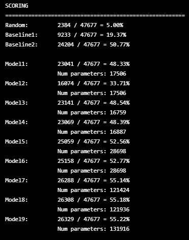

# Restaurant Recommendation Challenge

In this project, we are challenged to provide a list of recommendations to customers of a food delivery service. We are given limited information about the vendors, the customers, and the orders between the two parties. This information should be used to train recommender systems which outperform baselines and which are flexible in their recommendations. 

We will break up our analysis in three parts: data, training, and testing.

# Data

Let's summarize the most important facts about our data.

**Vendors**
- 100 vendors
- Useful features include:
  - Latitude and longitude
  - Primary and secondary food types
  - Rating
  - Delivery charge and serving distance
  - \# orders, $ sales, average sale (created via order information)
- All are located in the same area, although there are likely GPS errors
- We have vendor hours, but the features are confusing and perhaps unreliable

**Customers**
- 26,741 customers which have made at least one order
- We have locations of where customers make orders
  - No location information for customers who have not yet ordered
  - Most customers are located in the same area, but there are likely GPS errors
- We have gender and age features, but many entries are missing

**Orders**
- 131,942 orders
- Some features include:
  - Item count
  - Grand total and discount amount, promo code used
  - Delivery date/time, delivery distance, driver rating

There are many problems with the data that require cleaning and imputing, most notably with the location data. The locations have been transformed in an unknown way to mask locations, but the transformation is claimed to be isometric so that distances are preserved. Even so, GPS errors are likely present. 

        

    Maps of customers and vendors at different zoom levels. The location outliers are projected to an ellipse around the city.

Customers with no orders have been removed. Customer features such as age and gender are likely to be unreliable due to the large amount of missing data, which leaves no real data for customers other than the orders they make. This will likely make it difficult to make accurate suggestions to customers who haven't made many orders.

## Representing Customers

Our task is to build a build a function which can input a customer and output a set of recommendations which align with the customer's taste. What is the best way to represent a customer? 

One natural way is to represent the customer, at least in part, is as a sequence of vendors from their prior orders. The vendors can be temporarily be represented using vendor ids, which may later be used for a data lookup. 

        

    Some customer order sequences.

One key statistic of this new data to keep in mind is the distribution of lengths of sequence orders per customer. Most customers have fewer than five orders. 

        

    A slice of the distribution of sequence lengths in training set.

These sequences ought to only contain only the $k$ most recent customer orders in order to capture the changing tastes of a customer. The size of $k$ is a hyperparameter, which we will set to 5. If a customer has more than $k$ orders, we can generate many subsequences of orders to extrapolate our limited data. If a customer has fewer than $k$ orders, then we can use a 'null token' to extend their orders to a length $k$ sequence. 

        

    Left-padded sequences with k=6 and null_token = 0.

## Representing Vendors

So a customor representation is simply a sequence of vendor representations. How do we represent vendors? A list of features we use follows:
- Latitude, longitude (outliers transformed)
- Serving distance
- Delivery charge
- Preparation time
- Vendor rating
- Status and rank (unknown meaning, but has nontrivial variance)
- Vendor category (food vs dessert)
- Primary (ptag) and secondary (vtag) food tags
- Total orders (log transformed)
- Amount sales (log transformed)
- Average sale (log transformed)
- Vendor id

The last three features listed are scraped from the orders file and and log transformed to remove skewness.

The categorical variables are one-hot encoded (or one-many encoding for vtags). Most categorical variables are binary, except ptag and vtag. Each vendor has a unique ptag and possibly multiple vtags. 

The continuous variables are separated from the categorical variables in case we'd like to design the model to operate differently on them.

The vendor id itself is included as a categorical variable, in addition to the data of the vendor. The reason for this is so that our models can capture the **brand loyalty** held by our customers. As we will see, this will be an important factor in building a good model. 

# Training

We choose to take a deep learning approach in building our models, and we do so withing the Pytorch framework. 

For the time being, our models will not consider the sequence structure and simply consider these as sets. A customer will typically be either a sum or a mean of the vendors in the sequence. Future models could take this structure into account (an LSTM, for example) but if the sequence structure isn't important, then it could lead to worsened performance.

## Model Prototype Structure

We train and test many differed models, but they are all similar to the prototype Model1. The structure of Model1 is outlined in a crude diagram below.

        

    The prototype structure of our recommender system.

We now will describe this diagram in words. 

The input is a sequence of vendor ids of length $k+1$, the first $k$ entries of which is the "customer sequence" and the final entry is the "vendor id", i.e. the target. The vendor data are stored in a frozen embedding layer which the inputs are fed into. The customer sequence is summed/averaged following the lookup so that each the customer and vendor representations are 1-D tensors. 

The ptag and vtag features are high-dimensional (on the order of 10s) 1-D subtensors of the customer/vendor representations. These features are separated and embedded via simple dense layers into smaller spaces of dimension $\textrm{ceil}(\textrm{log}_2(d_f))$ where $d_f$ is the dimension of feature $f$. The hope here is to learn similarities between different types of food types through customer order data. For example, we hope these embeddings learn to place different types of fast food tags closer to each other than their distance to other types of food. 

The embedded ptags and vtags are then concatenated with the rest of the features before being embedded as smaller-dimensional customer/vendor representations via dense layers following the same dimensionality reduction scheme as above. Hopefully, the model learns to place similar customers and vendors close together.

These new customer and vendor representations are then concatenated and fed through a sequence of dense layers, ending in a single classification node. Note that the output is a raw score, not a probability.

Note that each dense layer in the model is followed by an exponential linear unit activation function. 

## Optimization

We optimize our models with respect to a margin ranking loss function. This function requires two forward passes of the model. One pass takes the true target vendor id, the "positive sample", and the other takes a "negative sample", which here we define as a vendor id which is not contained in the customer sequence. Since the customer has not recently interacted with the negative sample, they are less likely to prefer it as a recommendation compared to the positive sample. Therefore, the negative sample should be ranked lower than the positive sample. The margin ranking loss is defined as 
$$\textrm{loss}(x_+, x_-) = \textrm{max}(0, x_- - x_+ + 1)$$
where $x_+$ and $x_-$ are the model outputs for the positive and negative samples, respectively. The loss is $0$ if the positive sample is ranked at least $1$ higher than the negative sample, and is positive otherwise. 

We use Pyotrch's AdamW optimizer with a constant weight decay of $0.0001$. The learning rate is updated through a scheduler using a learning rate finder heuristic.

        

    The learning rate finder output for Model8.

We attempted to use a 1cycle learning rate scheduler, following the advice of [this blog post by fastai](https://www.fast.ai/2018/07/02/adam-weight-decay/). However, we couldn't get it to perform as well as Pytorch's ReduceLROnPlateau scheduler with default parameters. The typical initial learning rate was between $0.001$ and $0.003$. 

The models typically converged after $200$ epochs. The training time was roughly an hour, but keep in mind that the model was trained on a home computer and a GPU was not available.

Most models were trained using a batch size of $32$. For one test, batch normalization was tested using larger batch sizes ($128$, $256$, and $512$), but this led to much worse performance. 

## Model Versions

As described above, all models tested are modifications of the Model1 prototype. I will describe the changes made in each iteration below.

**Model#**

1. The original prototype described above.
2. Add 30% dropout to non-embedding layers (not as performant as Model1).
3. Remove the dropout and batch normalization. The embedding layers between the customers and vendors now share parameters. 
4. Adds an extra dense layer to the end of the model.
5. Vendor ids themselves are incorporated as input data. This is an attempt to capture brand loyalty of the customers in our predictions. The vendor id's are one hot encoded during the forward pass. Then they are embedded into a smaller space before being concatenated with other features.
6. Customer representations are now a mean of the non-null orders in their sequence instead of a sum. This is an attempt to make stronger predictions about newer customers.
7. Remove the embedding layer for the vendor ids. The whole point of brand loyalty is that each brand (in this application, brand=vendor) is dissimilar from the others. Therefore, it is useful to store the vendor ids as orthogonal vectors. 
8. Add an extra dense layer to the end of the model.
9. Remove the customer and vendor embedding layers.

# Testing

Testing recommender systems is less intuitive than testing other predictive models. There are many common metrics to use, which can be found [here in this useful Medium article](https://medium.com/swlh/rank-aware-recsys-evaluation-metrics-5191bba16832). The idea of these methods are all similar: generate a list of top ranked items to show the user, and your score is based on how many of the items you recommend are relevant to the user. The word "relevant" is not well-defined, but normally means that the user has interacted with this item in the past. 

In our case, our items are the restaurants and the interactions are orders. One issue with our data is that a plurality of our users have only ordered from a single restaurant, which makes the above methods tricky/impossible to apply. This is because the user's single order is used as the target, and hence they will be considered to have no interactions. 

Recall that our model takes in a user's past five ($k=5$) orders as inputs together with one restaurant $R$ and tries to predict how likely the user will order from $R$ next. We will evaluate our model as follows. Given a customer sequence of vendors, and given the target restaurant $R$ which is next in the sequence, we use the model to generate a ranked list of $k=5$ more restaurants that it thinks is the most likely to be ordered from next. If R is among the $k$ generated restaurants, we add $+1$ to the score, otherwise $+0$. 

Since there are only $100$ restaurants to recommend from, it should be very feasible to simply score each one, sort the rankings, and slice the top $5$ as recommendations. This is a very privillaged position we are in since many recommender systems are deployed in a context where there are millions of items to recommend from. In that case, one could perform clustering based on the customer and vendor embeddings before ranking within the clusters.  

Each user in the test set may possibly geenerate many length $5+1$ sequences, and we shall use all of these during the evaluation process. In the deployed version of the model, we could simply give recommendations based on the last $5$ orders made by the user.

Baselines:
1) Recommend the $5$ most popular restaurants.
2) Given a sequence of $5$ orders, $m$ of which are unique and not null, recommend those restaurants together with the $5-m$ most popular restaurants. 

We will define 'popularity' of a vendor to be equal to its number of orders in the training data. Note that the unordered set of top five most popular vendors would be the same if we changed the definition of popularity of a vendor to be equal to its number of unique customers (although their rankings are slightly different, see the last cell of "Munging.ipynb"). 

## Results

During training, the models were saved every $10$ epochs. We can test how the models perform over time. The testing error does not decrease after a certain point, which is likely due to the regularization the weight decay provides. This ensures that our models are not overfit. The models typically converged by epoch 200, but sometimes before. A summary of model performance is obtained by testing each model at the points where they are close enough to convergence.

        

    The test scores for each model, around epoch 200, against the baseline models. 

Our biggest jumps in performance are at Model5 and Model7, which is where we incorporated and improved the brand loyalty part of our model.

As we can see, Model9 seems to be the most accurate by a thin margin. However, we lose the low-dimensional customer and vendor embeddings that we had from Model8. We may choose to use these embeddings for further analysis, such as clustering. This is why I prefer Model8. 

## Examining Outputs

We can see that Baseline2 already performs relatively well - simply recommending vendors from past orders and popular vendors goes a long way. How is our model making predictions? Let's examine some outputs from Model8.

        

    Examining model predictions against baseline predictions.

There's a couple things to note here. I'll list some observations
- Our model gives similar predictions to the baseline, but they aren't exactly the same. We can see that the model can correctly predict the target order, even if the customer has not interacted with the target vendor yet (see Tests 7, 18, 21). This means that the model is likely learning some similarity between vendors, as we'd hoped for. We can summarize this point with a matrix.

        

- As expected the model performance is very poor for new customers. A whopping $22\%$ of our test inputs are the zero vector, as we have no data on brand new customers. A quick comparison the model output on the zero vector against the most popular vendors shows that the model is working as intended for new customers.

        

- For every non-zero input among these tests, the top prediction given by our model is a vendor which the customer has recently ordered from. 
- An even stronger statement is true: every customer with at least two/three unique orders, the top two/three predictions the model gives are among the vendors the customer has recently ordered from. This means that the model is strongly preferring to output the unique inputs. One can check that most unique inputs are also outputs. 
- With the previous point in mind, the model does not necessarily output every unique input (see Test 3)

It might be interesting to breakdown the comparison of the model vs. the baseline by number of non-zero orders in the input sequence. 

        

Let's record a list of observations.
- The model and the baseline have nearly the same performance on the brand new customers.
- The model has the most gain over the baseline when the number of orders is $1$. 
- The model beats the baseline in every category.
- The more customer data we are given, the better the performance.

# Ideas for Improvement

Here I will list some tweaks that may improve the results, based on the analysis. Might include rambling thoughts as well.

1. Since the model performance increased for longer sequences, we might have better results if we increase the size of our max sequence window length to be greater than $5$. I was worried that a customer's tastes may drift quickly, although that doesn't seem to be the case, or at least it doesn't drift so quickly. At this time, I'd prefer not to retrain all of the models. 
2. There is a bug in the negative sampline function. Currently, it may choose the target as a negative sample, and only avoids choosing those vendor ids in the customer sequence. This is not the end of the world, and it will likely not increase performance that much, but it is worth recording here. I don't want to retrain all models over this possibly small bug.
3. We may change the loss function slightly. There is something called "adaptive ranking loss" which passes forward many negative samples and picks the final negative sample to be the one which is ranked closest to the positive sample. I've also seen someone add a cosine similarity type of loss fucntion to the ranking loss.
4. It may be that our method of evaluation isn't ideal. I wasn't exactly sure what to do here, but maybe this should be thought about a little more. Perhaps we could offer more recommendations than the length of the input sequences.
5. Not really sure what to do about brand new customers. We can try incorporating the age, gender, and account creation dates into the model, but I have a feeling these will not be very useful. Other than this, we have no data on new customers. 
