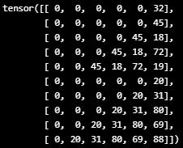

# Restaurant Recommendation Challenge

In this project, we are challenged to provide a list of recommendations to customers of a food delivery service. We are given limited information about the vendors, the customers, and the orders between the two parties. This information should be used to train recommender systems which outperform baselines and which are flexible in their recommendations. 

We will break up our analysis in three parts: data, training, and testing.

# Data

First, let's summarize the most important facts about our data.

**Vendors**
- 100 vendors
- Useful features include:
  - Latitude and longitude
  - Primary and secondary food types
  - Rating
  - Delivery charge and serving distance
  - \# orders, $ sales, average sale (created via order information)
- All are located in the same area, although there are likely GPS errors
- We have vendor hours, but the features are confusing and perhaps unreliable

**Customers**
- 26,741 customers which have made at least one order
- We have locations of where customers make orders
  - No location information for customers who have not yet ordered
  - Most customers are located in the same area, but there are likely GPS errors
- We have gender and age features, but many entries are missing

**Orders**
- 131,942 orders
- Some features include:
  - Item count
  - Grand total and discount amount, promo code used
  - Delivery date/time, delivery distance, driver rating

## Representing Customers

Our task is to build a build a function which can input a customer and output a set of recommendations which align with the customer's taste. What is the best way to represent a customer? 

One natural way is to represent the customer, at least in part, is as a sequence of vendors from their prior orders. The vendors can be temporarily be represented using vendor ids, which may later be used for a data lookup. 

        

    Some customer order sequences.

One key statistic of this new data to keep in mind is the distribution of lengths of sequence orders per customer. In other words, how many orders does each customer make? A plurality of customers only make one order, which may cause problems later.

        

    A slice of the distribution of sequence lengths in training set.

These sequences ought to only contain only the $k$ most recent customer orders in order to capture the changing tastes of a customer. The size of $k$ is a hyperparameter, which we will set to 5. If a customer has more than $k$ orders, we can generate many subsequences of orders to extrapolate our limited data. If a customer has fewer than $k$ orders, then we can use a 'null token' to extend their orders to a length $k$ sequence. 

        

    Left-padded sequences with k=6 and null_token = 0.

## Representing Vendors

So a customor representation is simply a sequence of vendor representations. How do we represent vendors?

